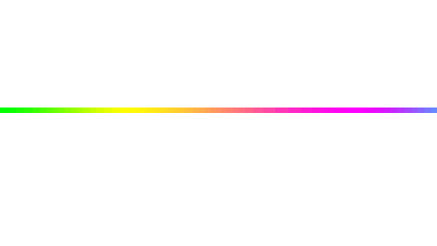

<h3>👋 Olá, eu sou a Samira!</h3>

  🎓 <strong>Estudante de Ciência da Computação</strong> 
  💻 Em constante aprendizado e evolução na área de tecnologia

<h3>🚀 Sobre mim: </h3>

  Sou estudante de <strong>Ciência da Computação</strong>, apaixonada por tecnologia
  e sempre buscando aprender algo novo.

  Este perfil reúne meus <strong>estudos, projetos, exercícios e experimentos</strong>,
  acompanhando minha evolução durante a graduação.

<h3>🛠️ Linguagens & Tecnologias</h3>

  &nbsp;&nbsp;
  &nbsp;&nbsp;
  &nbsp;&nbsp;
  &nbsp;&nbsp;
  &nbsp;&nbsp;
  

<h3>✨ Minha jornada</h3>

  Cada projeto é uma oportunidade de aprender, experimentar e evoluir.

  Este repositório representa minha jornada como estudante e futura profissional
  de tecnologia. 🚀

 

<strong>💡 Aprender • Criar • Evoluir</strong>

